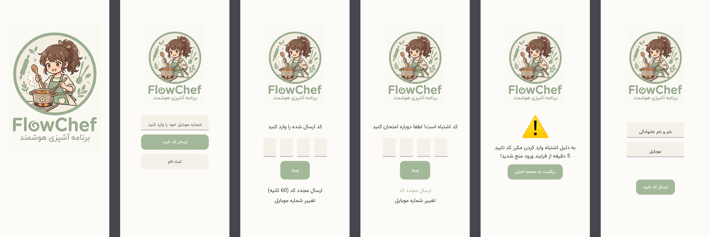
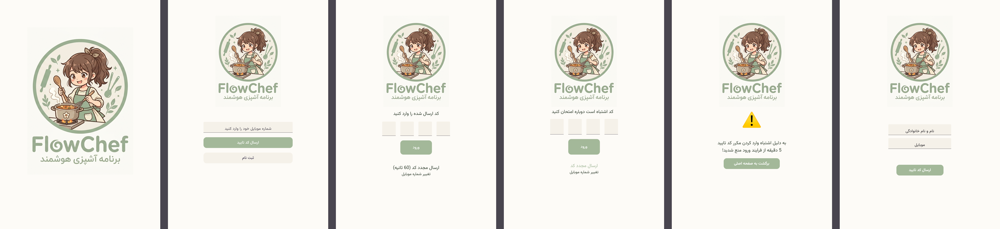
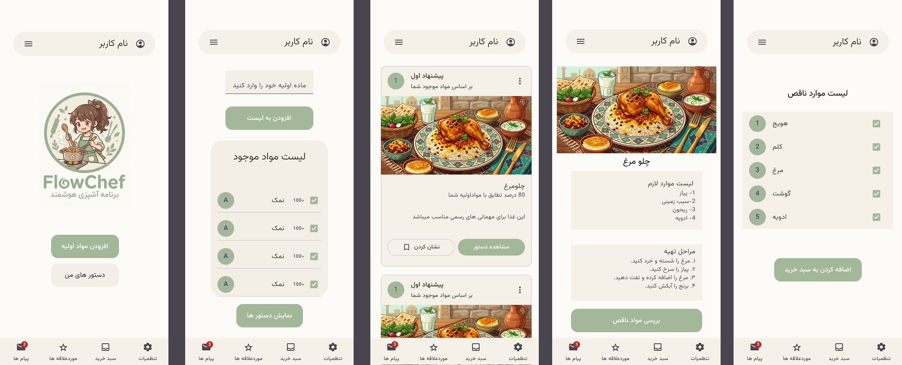
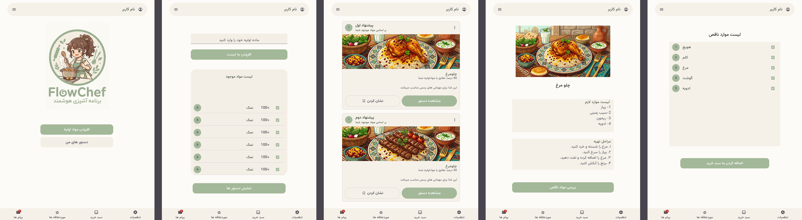
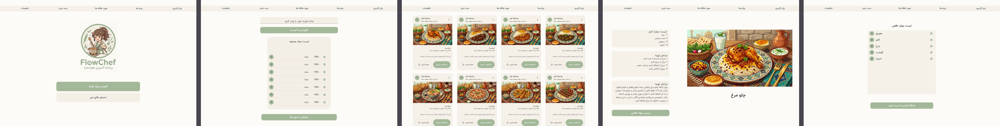
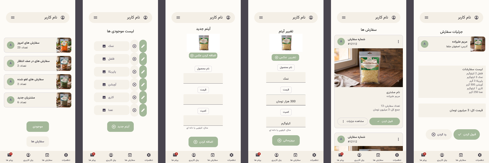
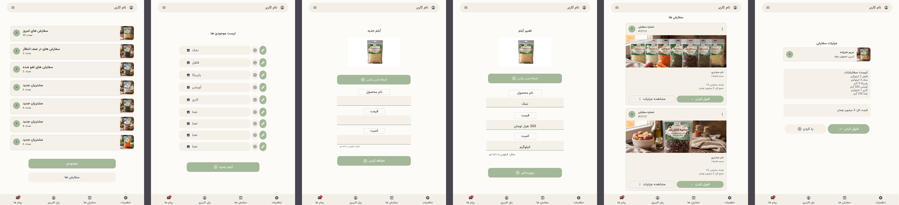


# Smart Cooking — UI/UX Design

A responsive UI/UX design for a smart cooking application, designed with **Material Design 3**.

The project focuses on creating a consistent and responsive experience across **Mobile, Tablet, and Desktop** screen sizes.

---

## 🎨 Design System

The interface is designed based on **Material Design 3**, with a focus on:

- Responsive layouts
- Consistent components
- Clear visual hierarchy
- Accessibility
- Cross-device consistency
- Reusable UI patterns

**Design Tool:** Figma  
**Design System:** Material Design 3

---

# 01 — Login

The Login experience has been designed responsively for three different screen sizes.

### 📱 Mobile

[View Login Design in Figma](https://www.figma.com/design/fuKIc5mzJFCzOokQiHGZ1Q/UI-UX-Professor-Imani?node-id=27-123)

### 📱 Tablet

[View Login Design in Figma](https://www.figma.com/design/fuKIc5mzJFCzOokQiHGZ1Q/UI-UX-Professor-Imani?node-id=249-4770)

### 🖥️ Desktop

[View Login Design in Figma](https://www.figma.com/design/fuKIc5mzJFCzOokQiHGZ1Q/UI-UX-Professor-Imani?node-id=249-4960)

---

# 02 — Main Task

The main application interface is designed for the primary user experience.

The layout adapts to different screen sizes while maintaining a consistent design language.

### 📱 Mobile

[View Login Design in Figma](https://www.figma.com/design/fuKIc5mzJFCzOokQiHGZ1Q/UI-UX-Professor-Imani?node-id=35-235)

### 📱 Tablet

[View Login Design in Figma](https://www.figma.com/design/fuKIc5mzJFCzOokQiHGZ1Q/UI-UX-Professor-Imani?node-id=242-2139)

### 🖥️ Desktop

[View Login Design in Figma](https://www.figma.com/design/fuKIc5mzJFCzOokQiHGZ1Q/UI-UX-Professor-Imani?node-id=249-2782)

### 🔗 Figma

---

# 03 — Second User — Seller

The second user interface is designed for sellers of ingredients.

This section also follows the same responsive design approach across Mobile, Tablet, and Desktop.

### 📱 Mobile

[View Login Design in Figma](https://www.figma.com/design/fuKIc5mzJFCzOokQiHGZ1Q/UI-UX-Professor-Imani?node-id=72-1090)

### 📱 Tablet

[View Login Design in Figma](https://www.figma.com/design/fuKIc5mzJFCzOokQiHGZ1Q/UI-UX-Professor-Imani?node-id=307-9655)

### 🖥️ Desktop

[View Login Design in Figma](https://www.figma.com/design/fuKIc5mzJFCzOokQiHGZ1Q/UI-UX-Professor-Imani?node-id=310-10638)

### 🔗 Figma
---

# 📐 Responsive Design

All three sections were designed for:

| Platform | Design |
|---|---|
| 📱 Mobile | ✓ |
| 📱 Tablet | ✓ |
| 🖥️ Desktop | ✓ |

The goal was to maintain a consistent visual system while adapting layouts and components to different screen sizes.

---

# 🛠 Tools & Technologies

- **Figma**
- **Material Design 3**
- **UI/UX Design**
- **Responsive Design**
- **Prototyping**

---

# 🔗 Complete Figma Project

[View Full Project in Figma](https://www.figma.com/design/fuKIc5mzJFCzOokQiHGZ1Q/UI-UX-Professor-Imani?node-id=310-10638&t=MJIbkqW2ms9eYNqq-1)
